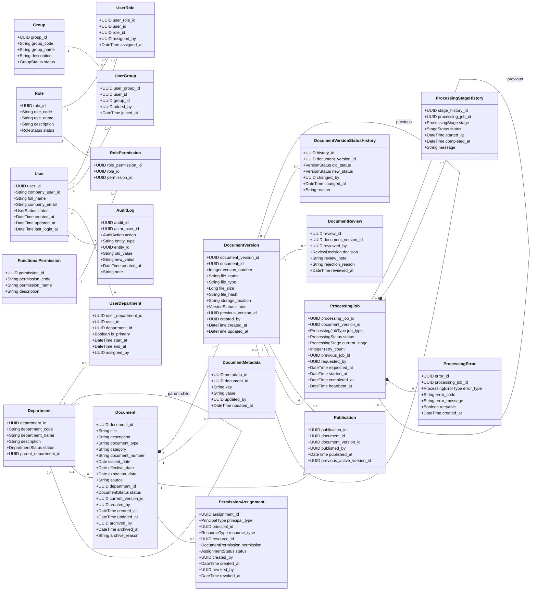

# MÔ TẢ CHI TIẾT SƠ ĐỒ LỚP – ENTERPRISE RAG PLATFORM

classDiagram
direction LR

%% =========================================================
%% 1. USER & ORGANIZATION
%% =========================================================

class User {
    +UUID user_id
    +String company_user_id
    +String full_name
    +String company_email
    +UserStatus status
    +DateTime created_at
    +DateTime updated_at
    +DateTime last_login_at
}

class Role {
    +UUID role_id
    +String role_code
    +String role_name
    +String description
    +RoleStatus status
    +DateTime created_at
    +DateTime updated_at
}

class Group {
    +UUID group_id
    +String group_code
    +String group_name
    +String description
    +GroupStatus status
    +DateTime created_at
    +DateTime updated_at
}

class Department {
    +UUID department_id
    +String department_code
    +String department_name
    +String description
    +DepartmentStatus status
    +UUID parent_department_id
    +DateTime created_at
    +DateTime updated_at
}

class UserRole {
    +UUID user_role_id
    +UUID user_id
    +UUID role_id
    +UUID assigned_by
    +DateTime assigned_at
}

class UserGroup {
    +UUID user_group_id
    +UUID user_id
    +UUID group_id
    +UUID added_by
    +DateTime joined_at
}

class UserDepartment {
    +UUID user_department_id
    +UUID user_id
    +UUID department_id
    +Boolean is_primary
    +DateTime start_at
    +DateTime end_at
    +UUID assigned_by
}

%% =========================================================
%% 2. FUNCTIONAL RBAC
%% =========================================================

class FunctionalPermission {
    +UUID permission_id
    +String permission_code
    +String permission_name
    +String description
}

class RolePermission {
    +UUID role_permission_id
    +UUID role_id
    +UUID permission_id
    +UUID assigned_by
    +DateTime assigned_at
}

%% =========================================================
%% 3. DOCUMENT
%% =========================================================

class Document {
    +UUID document_id
    +String title
    +String description
    +String document_type
    +String category
    +String document_number
    +Date issued_date
    +Date effective_date
    +Date expiration_date
    +String source
    +UUID department_id
    +DocumentStatus status
    +UUID current_version_id
    +UUID created_by
    +DateTime created_at
    +DateTime updated_at
    +UUID archived_by
    +DateTime archived_at
    +String archive_reason
}

class DocumentVersion {
    +UUID document_version_id
    +UUID document_id
    +Integer version_number
    +String file_name
    +String file_type
    +Long file_size
    +String file_hash
    +String storage_location
    +VersionStatus status
    +UUID previous_version_id
    +UUID created_by
    +DateTime created_at
    +DateTime updated_at
}

class DocumentMetadata {
    +UUID metadata_id
    +UUID document_id
    +String key
    +String value
    +UUID updated_by
    +DateTime updated_at
}

class DocumentVersionStatusHistory {
    +UUID history_id
    +UUID document_version_id
    +VersionStatus old_status
    +VersionStatus new_status
    +UUID changed_by
    +DateTime changed_at
    +String reason
}

%% =========================================================
%% 4. REVIEW / PUBLISH
%% =========================================================

class DocumentReview {
    +UUID review_id
    +UUID document_version_id
    +UUID reviewed_by
    +ReviewDecision decision
    +String review_note
    +String rejection_reason
    +DateTime reviewed_at
}

class Publication {
    +UUID publication_id
    +UUID document_id
    +UUID document_version_id
    +UUID published_by
    +DateTime published_at
    +UUID previous_active_version_id
}

%% =========================================================
%% 5. DOCUMENT ACCESS CONTROL
%% =========================================================

class PermissionAssignment {
    +UUID assignment_id
    +PrincipalType principal_type
    +UUID principal_id
    +ResourceType resource_type
    +UUID resource_id
    +DocumentPermission permission
    +AssignmentStatus status
    +UUID created_by
    +DateTime created_at
    +UUID updated_by
    +DateTime updated_at
    +UUID revoked_by
    +DateTime revoked_at
}

class EffectivePermission {
    <<projection>>
    +UUID user_id
    +UUID document_id
    +DocumentPermission permission
    +Boolean allowed
}

class PermissionSource {
    <<projection>>
    +PermissionSourceType source_type
    +UUID source_id
    +UUID assignment_id
}

class PermissionMatrixView {
    <<projection>>
    +UUID user_id
    +UUID document_id
    +DocumentPermission permission
    +Boolean effective
}

class AuthorizationService {
    <<domain service>>
    +resolvePermissions(userId, documentId)
    +canRead(userId, documentId)
    +canDownload(userId, documentId)
    +getPermissionSources(userId, documentId)
}

%% =========================================================
%% 6. PROCESSING
%% =========================================================

class ProcessingJob {
    +UUID processing_job_id
    +UUID document_version_id
    +ProcessingJobType job_type
    +ProcessingStatus status
    +ProcessingStage current_stage
    +Integer retry_count
    +UUID previous_job_id
    +UUID requested_by
    +DateTime requested_at
    +DateTime started_at
    +DateTime completed_at
    +DateTime heartbeat_at
}

class ProcessingStageHistory {
    +UUID stage_history_id
    +UUID processing_job_id
    +ProcessingStage stage
    +StageStatus status
    +DateTime started_at
    +DateTime completed_at
    +String message
}

class ProcessingError {
    +UUID error_id
    +UUID processing_job_id
    +ProcessingErrorType error_type
    +String error_code
    +String error_message
    +String internal_reference
    +Boolean retryable
    +DateTime created_at
}

%% =========================================================
%% 7. AUDIT
%% =========================================================

class AuditLog {
    +UUID audit_id
    +UUID actor_user_id
    +AuditAction action
    +String entity_type
    +UUID entity_id
    +String old_value
    +String new_value
    +DateTime created_at
    +String note
}

%% =========================================================
%% 8. ENUMS
%% =========================================================

class UserStatus {
    <<enumeration>>
    ACTIVE
    LOCKED
    DISABLED
}

class RoleStatus {
    <<enumeration>>
    ACTIVE
    DISABLED
}

class GroupStatus {
    <<enumeration>>
    ACTIVE
    DISABLED
}

class DepartmentStatus {
    <<enumeration>>
    ACTIVE
    DISABLED
}

class DocumentStatus {
    <<enumeration>>
    DRAFT
    PUBLISHED
    ARCHIVED
}

class VersionStatus {
    <<enumeration>>
    DRAFT
    READY_FOR_REVIEW
    ACTIVE
    REJECTED
    SUPERSEDED
}

class ReviewDecision {
    <<enumeration>>
    APPROVE
    REJECT
    REPROCESS
}

class PrincipalType {
    <<enumeration>>
    USER
    ROLE
    GROUP
    DEPARTMENT
}

class ResourceType {
    <<enumeration>>
    DOCUMENT
}

class DocumentPermission {
    <<enumeration>>
    READ
    DOWNLOAD
    MANAGE
    REVIEW
    PUBLISH
    ARCHIVE
    MANAGE_PERMISSION
}

class AssignmentStatus {
    <<enumeration>>
    ACTIVE
    REVOKED
}

class PermissionSourceType {
    <<enumeration>>
    DIRECT
    ROLE
    GROUP
    DEPARTMENT
}

class ProcessingStatus {
    <<enumeration>>
    PENDING
    RUNNING
    SUCCEEDED
    FAILED
    CANCELLED
}

class ProcessingJobType {
    <<enumeration>>
    INITIAL_PROCESS
    NEW_VERSION
    REPROCESS
}

class ProcessingStage {
    <<enumeration>>
    FILE_VALIDATION
    EXTRACTION
    OCR
    PARSING
    CHUNKING
    EMBEDDING
    INDEXING
    FINALIZING
}

class StageStatus {
    <<enumeration>>
    PENDING
    RUNNING
    SUCCEEDED
    FAILED
    SKIPPED
}

class ProcessingErrorType {
    <<enumeration>>
    FILE_ERROR
    UNSUPPORTED_FORMAT
    OCR_ERROR
    EXTRACTION_ERROR
    PARSING_ERROR
    CHUNKING_ERROR
    EMBEDDING_ERROR
    INDEXING_ERROR
    STORAGE_ERROR
    TIMEOUT
    SYSTEM_ERROR
}

class AuditAction {
    <<enumeration>>
    CREATE
    UPDATE
    ENABLE
    DISABLE
    ASSIGN
    REVOKE
    REVIEW
    PUBLISH
    ARCHIVE
    REPROCESS
}

%% =========================================================
%% RELATIONSHIPS - USER
%% =========================================================

User "1" --> "0..*" UserRole
Role "1" --> "0..*" UserRole

User "1" --> "0..*" UserGroup
Group "1" --> "0..*" UserGroup

User "1" --> "0..*" UserDepartment
Department "1" --> "0..*" UserDepartment

Department "0..1" --> "0..*" Department : parent / child

Role "1" --> "0..*" RolePermission
FunctionalPermission "1" --> "0..*" RolePermission

%% =========================================================
%% RELATIONSHIPS - DOCUMENT
%% =========================================================

Document "1" *-- "1..*" DocumentVersion : versions

Document "1" --> "0..*" DocumentMetadata : metadata

Department "0..1" --> "0..*" Document : classifies

DocumentVersion "0..1" --> "0..1" DocumentVersion : previous version

DocumentVersion "1" --> "0..*" DocumentVersionStatusHistory : status history

DocumentVersion "1" --> "0..*" DocumentReview : reviews

Document "1" --> "0..*" Publication
DocumentVersion "1" --> "0..1" Publication : published version

%% =========================================================
%% RELATIONSHIPS - ACCESS CONTROL
%% =========================================================

User ..> PermissionAssignment : principal USER
Role ..> PermissionAssignment : principal ROLE
Group ..> PermissionAssignment : principal GROUP
Department ..> PermissionAssignment : principal DEPARTMENT

Document "1" <-- "0..*" PermissionAssignment : resource

User "1" --> "0..*" EffectivePermission
Document "1" --> "0..*" EffectivePermission

EffectivePermission "1" --> "1..*" PermissionSource

PermissionAssignment "1" --> "0..*" PermissionSource

PermissionMatrixView ..> EffectivePermission : displays

AuthorizationService ..> PermissionAssignment : evaluates
AuthorizationService ..> UserRole
AuthorizationService ..> UserGroup
AuthorizationService ..> UserDepartment
AuthorizationService ..> EffectivePermission : calculates

%% =========================================================
%% RELATIONSHIPS - PROCESSING
%% =========================================================

DocumentVersion "1" --> "0..*" ProcessingJob : processing attempts

ProcessingJob "0..1" --> "0..1" ProcessingJob : previous job

ProcessingJob "1" *-- "0..*" ProcessingStageHistory

ProcessingJob "1" *-- "0..*" ProcessingError

%% =========================================================
%% RELATIONSHIPS - AUDIT
%% =========================================================

User "1" --> "0..*" AuditLog : actor

PermissionAssignment ..> AuditLog : changes logged
Document ..> AuditLog : changes logged
DocumentVersion ..> AuditLog : changes logged
ProcessingJob ..> AuditLog : actions logged
Role ..> AuditLog : changes logged
Group ..> AuditLog : changes logged
Department ..> AuditLog : changes logged


## 1. Mục đích tài liệu

Tài liệu này mô tả chi tiết sơ đồ lớp của hệ thống **Enterprise RAG Platform** dựa trên các Use Case đã được đặc tả, gồm quản lý người dùng, vai trò, nhóm, phòng ban, phân quyền tài liệu, quản lý tài liệu và phiên bản, kiểm duyệt, xuất bản, Archive, theo dõi xử lý, tài liệu lỗi và yêu cầu xử lý lại.

Mục tiêu của mô hình là tách rõ bốn nhóm vấn đề:

```text
Người dùng là ai?
        ↓
Người dùng được làm chức năng gì?
        ↓
Người dùng được truy cập tài liệu nào?
        ↓
Tài liệu/phiên bản nào đủ điều kiện trở thành tri thức hiện hành?
```

## 2. Các nhóm domain chính

1. **Identity & Organization**: `User`, `Role`, `Group`, `Department`.
2. **Functional Authorization**: `FunctionalPermission`, `RolePermission`.
3. **Document Management**: `Document`, `DocumentVersion`, `DocumentMetadata`.
4. **Review & Publication**: `DocumentReview`, `Publication`.
5. **Document Access Control**: `PermissionAssignment`.
6. **Processing**: `ProcessingJob`, `ProcessingStageHistory`, `ProcessingError`.
7. **Audit**: `AuditLog`.

## 3. Sơ đồ lớp tổng thể




# 4. Identity & Organization

## 4.1. User

`User` đại diện cho một người dùng tồn tại trong Enterprise RAG Platform. Lớp này lưu thông tin hồ sơ và trạng thái sử dụng RAG, không quản lý mật khẩu công ty nếu hệ thống xác thực qua tài khoản doanh nghiệp.

| Thuộc tính | Ý nghĩa |
|---|---|
| `user_id` | Định danh duy nhất của User trong RAG. |
| `company_user_id` | Định danh tương ứng ở hệ thống danh tính doanh nghiệp. |
| `full_name` | Họ tên người dùng. |
| `company_email` | Email doanh nghiệp. |
| `status` | `ACTIVE`, `LOCKED`, `DISABLED`. |
| `created_at`, `updated_at` | Thời gian tạo và cập nhật. |
| `last_login_at` | Lần đăng nhập gần nhất. |

`ACTIVE` chỉ có nghĩa User được sử dụng hệ thống; không có nghĩa User được đọc toàn bộ tài liệu.

## 4.2. Role

`Role` đại diện cho vai trò nghiệp vụ/hệ thống, ví dụ `EMPLOYEE`, `ADMIN`, `DOCUMENT_REVIEWER`.

Role chủ yếu trả lời:

> User được phép thực hiện chức năng nào?

Role không nên là nguồn duy nhất quyết định User được đọc tài liệu nào.

## 4.3. Group

`Group` là tập hợp người dùng linh hoạt theo dự án hoặc mục đích nghiệp vụ, ví dụ `PROJECT_ALPHA`, `HR_MANAGER`, `POLICY_REVIEWER`.

Một User có thể thuộc nhiều Group và một Group có thể chứa nhiều User.

## 4.4. Department

`Department` đại diện cho đơn vị tổ chức chính thức như HR, Finance, IT.

Department có thể có quan hệ cha-con qua `parent_department_id`, ví dụ:

```text
Khối Công nghệ
├── Phòng AI
└── Phòng Data
```

Department khác Group: Department phản ánh cơ cấu tổ chức, Group là tập hợp linh hoạt.

## 4.5. UserRole

`UserRole` là lớp liên kết nhiều-nhiều giữa User và Role.

```text
User N ↔ N Role
```

Nó còn giúp lưu ai gán Role và thời điểm gán.

## 4.6. UserGroup

`UserGroup` biểu diễn membership giữa User và Group.

Ví dụ:

```text
User A
├── HR_MANAGER
└── PROJECT_ALPHA
```

## 4.7. UserDepartment

`UserDepartment` biểu diễn quan hệ User–Department và có thể lưu lịch sử chuyển phòng ban.

Ví dụ:

```text
User A
HR       2025-01-01 → 2026-06-30
Finance  2026-07-01 → hiện tại
```

`is_primary` hỗ trợ trường hợp doanh nghiệp cho phép User thuộc nhiều Department.


# 5. Functional Authorization

## 5.1. FunctionalPermission

`FunctionalPermission` mô tả quyền sử dụng chức năng, ví dụ:

```text
ASK_KNOWLEDGE
VIEW_SOURCE
MANAGE_DOCUMENT
UPLOAD_DOCUMENT
REVIEW_DOCUMENT
PUBLISH_DOCUMENT
MANAGE_USER
MANAGE_ROLE
MANAGE_GROUP
MANAGE_DEPARTMENT
MANAGE_ACCESS_POLICY
```

## 5.2. RolePermission

`RolePermission` liên kết Role với FunctionalPermission.

Ví dụ:

```text
ADMIN
├── MANAGE_USER
├── MANAGE_ROLE
├── MANAGE_DOCUMENT
└── PUBLISH_DOCUMENT
```

Thiết kế này tránh hard-code toàn bộ logic kiểu `if role == admin then allow everything`.

---

# 6. Document Management

## 6.1. Document

`Document` là tài liệu logic ở cấp nghiệp vụ.

Ví dụ:

```text
DOC-001
"Quy định nghỉ phép"
```

Một Document có thể tồn tại qua nhiều phiên bản.

| Thuộc tính | Ý nghĩa |
|---|---|
| `document_id` | Định danh tài liệu. |
| `title` | Tên tài liệu. |
| `description` | Mô tả. |
| `document_type` | Loại tài liệu. |
| `category` | Nhóm nghiệp vụ. |
| `document_number` | Số hiệu. |
| `issued_date` | Ngày ban hành. |
| `effective_date` | Ngày hiệu lực. |
| `expiration_date` | Ngày hết hiệu lực. |
| `source` | Nguồn. |
| `department_id` | Phòng ban sở hữu/phân loại nếu có. |
| `status` | `DRAFT`, `PUBLISHED`, `ARCHIVED`. |
| `current_version_id` | Phiên bản hiện hành. |
| `archived_by`, `archived_at`, `archive_reason` | Thông tin Archive. |

## 6.2. DocumentVersion

`DocumentVersion` đại diện cho một phiên bản nội dung cụ thể.

```text
Document 1 ─── N DocumentVersion
```

Ví dụ:

```text
DOC-001
├── v1 SUPERSEDED
├── v2 SUPERSEDED
└── v3 ACTIVE
```

| Thuộc tính | Ý nghĩa |
|---|---|
| `document_version_id` | Định danh version. |
| `document_id` | Document cha. |
| `version_number` | Số phiên bản. |
| `file_name` | Tên file nguồn. |
| `file_type` | Định dạng. |
| `file_size` | Kích thước. |
| `file_hash` | Hash phục vụ integrity/duplicate. |
| `storage_location` | Vị trí lưu file. |
| `status` | `DRAFT`, `READY_FOR_REVIEW`, `ACTIVE`, `REJECTED`, `SUPERSEDED`. |
| `previous_version_id` | Version trước đó. |

### Phân biệt Document và DocumentVersion

```text
Document
=
Tài liệu logic

DocumentVersion
=
Một nội dung cụ thể của tài liệu tại một thời điểm
```

Sửa metadata nghiệp vụ thường không tạo version mới. Thay file hoặc thay nội dung phải tạo version mới.

## 6.3. DocumentMetadata

Lưu các metadata mở rộng theo dạng key-value, ví dụ:

```text
topic = HR
language = vi
confidentiality = internal
```

Các trường nghiệp vụ cốt lõi, thường xuyên truy vấn vẫn nên đặt trực tiếp trong `Document`.

## 6.4. DocumentVersionStatusHistory

Lưu lịch sử chuyển trạng thái version:

```text
DRAFT
  ↓
READY_FOR_REVIEW
  ↓
ACTIVE
```

Mỗi lần thay đổi có thể lưu `old_status`, `new_status`, `changed_by`, `changed_at`, `reason`.


# 7. Review & Publication

## 7.1. DocumentReview

`DocumentReview` lưu kết quả kiểm duyệt của một version.

Ví dụ:

```text
DocumentVersion v4
        ↓
DocumentReview
decision = APPROVE
```

Decision có thể là:

```text
APPROVE
REJECT
REPROCESS
```

Nếu `REJECT`, hệ thống lưu `rejection_reason`. Nếu vấn đề là lỗi kỹ thuật, reviewer có thể chọn hướng `REPROCESS`.

## 7.2. Publication

`Publication` lưu sự kiện xuất bản một version.

Ví dụ trước Publish:

```text
v3 ACTIVE
v4 READY_FOR_REVIEW
```

Sau Publish:

```text
v3 → SUPERSEDED
v4 → ACTIVE
Document.current_version_id = v4
Document.status = PUBLISHED
```

Publication giúp truy vết ai publish, thời điểm nào, version nào và version active trước đó là gì.

---

# 8. Document Access Control

## 8.1. PermissionAssignment

Đây là lớp trung tâm của quyền truy cập tài liệu.

Mỗi assignment mô tả:

```text
Principal
+
Permission
+
Resource
```

Ví dụ:

```text
Group HR_MANAGER
      +
READ
      +
DOC-001
```

Có thể lưu:

```text
principal_type = GROUP
principal_id = G001
resource_type = DOCUMENT
resource_id = DOC-001
permission = READ
status = ACTIVE
```

### PrincipalType

```text
USER
ROLE
GROUP
DEPARTMENT
```

### DocumentPermission

```text
READ
DOWNLOAD
MANAGE
REVIEW
PUBLISH
ARCHIVE
MANAGE_PERMISSION
```

Một bảng `PermissionAssignment` giúp tránh phải tạo riêng:

```text
UserDocumentPermission
RoleDocumentPermission
GroupDocumentPermission
DepartmentDocumentPermission
```

## 8.2. Effective Permission

`PermissionAssignment` chỉ là nguồn cấp quyền; quyền thực tế của User phải được tính từ toàn bộ nguồn hợp lệ.

Ví dụ:

```text
User A
├── Direct READ DOC-001
├── Group HR → READ DOC-001
└── Department HR → READ DOC-002
```

Effective permission:

```text
DOC-001 → READ
DOC-002 → READ
```

Nếu Direct READ của DOC-001 bị thu hồi nhưng Group HR vẫn cấp READ, User vẫn còn quyền.

Do đó:

```text
Thu hồi PermissionAssignment
≠
User chắc chắn mất Effective Permission
```

## 8.3. Xem ma trận quyền

Ma trận quyền là projection/tổng hợp, không nhất thiết cần một bảng riêng.

Ví dụ:

| User | DOC-001 | DOC-002 | DOC-003 |
|---|---|---|---|
| User A | READ | READ | — |
| User B | — | READ | READ |
| User C | READ | — | — |

Khi xem chi tiết một ô, hệ thống nên giải thích nguồn quyền:

```text
User A × DOC-001
READ = YES

Sources:
- Group HR_MANAGER
- Department HR
```


# 9. Processing

## 9.1. ProcessingJob

`ProcessingJob` đại diện cho một lần xử lý kỹ thuật của một `DocumentVersion`.

```text
DocumentVersion 1 ─── N ProcessingJob
```

Ví dụ:

```text
v3
├── Job #1 FAILED
├── Job #2 FAILED
└── Job #3 SUCCEEDED
```

### Trạng thái

```text
PENDING
RUNNING
SUCCEEDED
FAILED
CANCELLED
```

### Loại Job

```text
INITIAL_PROCESS
NEW_VERSION
REPROCESS
```

## 9.2. ProcessingStageHistory

Một job có thể đi qua:

```text
FILE_VALIDATION
    ↓
EXTRACTION
    ↓
OCR
    ↓
PARSING
    ↓
CHUNKING
    ↓
EMBEDDING
    ↓
INDEXING
    ↓
FINALIZING
```

`ProcessingStageHistory` lưu trạng thái từng stage.

Ví dụ:

```text
FILE_VALIDATION  SUCCEEDED
EXTRACTION       SUCCEEDED
OCR              SUCCEEDED
CHUNKING         SUCCEEDED
EMBEDDING        FAILED
```

## 9.3. ProcessingError

`ProcessingError` lưu lỗi của job.

Ví dụ:

```text
error_type = EMBEDDING_ERROR
error_code = EMBEDDING_PROVIDER_TIMEOUT
error_message = Không thể hoàn tất bước tạo embedding
retryable = true
```

Các nhóm lỗi có thể gồm:

```text
FILE_ERROR
UNSUPPORTED_FORMAT
OCR_ERROR
EXTRACTION_ERROR
PARSING_ERROR
CHUNKING_ERROR
EMBEDDING_ERROR
INDEXING_ERROR
STORAGE_ERROR
TIMEOUT
SYSTEM_ERROR
```

Không expose API key, password, token hoặc raw stack trace chứa secret.

---

# 10. Xem trạng thái xử lý tài liệu

Use Case này đọc:

```text
Document
    ↓
DocumentVersion
    ↓
ProcessingJob
```

Ví dụ:

```text
DOC-001 / v4

Processing Status:
RUNNING

Current Stage:
CHUNKING
```

Admin có thể xác định job đang chờ, đang chạy, thành công, thất bại, đang ở stage nào và lỗi gì.

---

# 11. Xem tài liệu xử lý lỗi

Không cần class `FailedDocument`.

Danh sách lỗi được suy ra từ ProcessingJob hiện tại/gần nhất có hiệu lực.

```text
Latest effective Processing Job
          ↓
        FAILED?
        /           YES      NO
      ↓         ↓
Hiển thị     Không hiển thị
```

Ví dụ:

```text
v3
├── Job #1 FAILED
└── Job #2 SUCCEEDED
```

v3 không còn được coi là đang lỗi.

---

# 12. Yêu cầu xử lý lại

Reprocess tạo `ProcessingJob` mới cho cùng một `DocumentVersion`.

```text
DocumentVersion v3
├── Job #1 FAILED
└── Job #2 RUNNING
```

Không tạo version mới nếu source file không thay đổi.

Quy tắc:

```text
File không đổi + Pipeline lỗi
→ REPROCESS

File/nội dung thay đổi
→ NEW VERSION
```

---

# 13. Archive tài liệu

Archive tác động ở cấp `Document`.

Trước Archive:

```text
DOC-001 = PUBLISHED

v1 SUPERSEDED
v2 SUPERSEDED
v3 ACTIVE
```

Sau Archive:

```text
DOC-001 = ARCHIVED
```

Các version và lịch sử vẫn được giữ.

```text
ARCHIVE ≠ DELETE
```

và:

```text
ARCHIVE Document
≠
ACTIVE Version → SUPERSEDED
```

---

# 14. AuditLog

`AuditLog` ghi lại các thao tác quan trọng.

Ví dụ:

```text
Admin A
UPDATE
User U001
```

```text
Admin B
PUBLISH
DocumentVersion v4
```

```text
Admin C
REVOKE
PermissionAssignment PA-01
```

Audit trả lời:

```text
Ai?
Làm gì?
Trên đối tượng nào?
Khi nào?
Thay đổi từ gì sang gì?
```


# 15. Ba State Machine phải tách biệt

## 15.1. Document Status

```text
DRAFT
  ↓
PUBLISHED
  ↓
ARCHIVED
```

## 15.2. DocumentVersion Status

```text
DRAFT
  ↓
READY_FOR_REVIEW
  ↓
ACTIVE
```

hoặc:

```text
READY_FOR_REVIEW
      ↓
REJECTED
```

Khi version mới được publish:

```text
old ACTIVE → SUPERSEDED
new candidate → ACTIVE
```

## 15.3. ProcessingJob Status

```text
PENDING
  ↓
RUNNING
  ↓
SUCCEEDED
```

hoặc:

```text
RUNNING
  ↓
FAILED
```

Nguyên tắc:

```text
Document.status
≠
DocumentVersion.status
≠
ProcessingJob.status
```

---

# 16. Luồng vòng đời tài liệu hoàn chỉnh

```text
Admin Upload
    ↓
Document
    ↓
DocumentVersion v1
    ↓
ProcessingJob
    ↓
PENDING
    ↓
RUNNING
    ↓
SUCCEEDED
    ↓
DocumentVersion = READY_FOR_REVIEW
    ↓
DocumentReview
    ↓
APPROVE
    ↓
Publication
    ↓
DocumentVersion = ACTIVE
    ↓
Document = PUBLISHED
```

Nếu processing lỗi:

```text
RUNNING
  ↓
FAILED
  ↓
Admin xem lỗi
  ↓
Reprocess
  ↓
ProcessingJob mới
```

Nếu review không đạt:

```text
READY_FOR_REVIEW
      ↓
REJECTED
```

---

# 17. Luồng tạo phiên bản mới

Giả sử:

```text
DOC-001
v3 ACTIVE
```

Admin upload nội dung mới:

```text
Tạo phiên bản mới
       ↓
v4 DRAFT
       ↓
ProcessingJob
       ↓
SUCCEEDED
       ↓
v4 READY_FOR_REVIEW
```

Trong khi đó v3 vẫn ACTIVE và Employee vẫn dùng v3.

Sau khi v4 được Review + Publish:

```text
v3 → SUPERSEDED
v4 → ACTIVE
Document.current_version_id = v4
```

---

# 18. Điều kiện tài liệu được sử dụng trong RAG

Một tài liệu chỉ được dùng làm tri thức hiện hành khi:

```text
Document.status = PUBLISHED
AND
DocumentVersion.status = ACTIVE
AND
User có READ permission
```

Có thể biểu diễn:

```text
CAN_USE_AS_KNOWLEDGE
=
PUBLISHED
AND ACTIVE
AND AUTHORIZED
```

Ví dụ hợp lệ:

```text
DOC-001 = PUBLISHED
v3 = ACTIVE
User A = READ
```

→ được retrieval.

Ví dụ không hợp lệ:

```text
DOC-002 = DRAFT
User A = READ
```

→ không retrieval.

Hoặc:

```text
DOC-003 = PUBLISHED
v4 = READY_FOR_REVIEW
User A = READ
```

→ v4 chưa được retrieval.

---

# 19. Authorization và RAG Retrieval

Luồng nên là:

```text
User đặt câu hỏi
      ↓
Xác định User
      ↓
Resolve Role / Group / Department / Direct Permission
      ↓
Effective Permission
      ↓
Authorized Documents
      ↓
Document = PUBLISHED
      ↓
Version = ACTIVE
      ↓
Retrieval
      ↓
Rerank
      ↓
Evidence Gate
      ↓
LLM
```

Không nên:

```text
Search toàn KB
↓
Rerank
↓
sau đó mới ACL Filter
```

Unauthorized document không nên trở thành candidate evidence ngay từ đầu.

Security invariant:

```text
Unauthorized Document
→ Không vào retrieval candidate
→ Không tới reranker
→ Không tới LLM
```


# 20. Mapping Use Case với lớp

| Use Case | Các lớp chính |
|---|---|
| Quản lý người dùng | User, UserRole, UserGroup, UserDepartment |
| Quản lý vai trò | Role, FunctionalPermission, RolePermission |
| Quản lý nhóm | Group, UserGroup |
| Quản lý phòng ban | Department, UserDepartment |
| Thiết lập quyền truy cập tài liệu | PermissionAssignment, Document |
| Xem ma trận quyền | User, Role, Group, Department, PermissionAssignment |
| Upload tài liệu | Document, DocumentVersion, ProcessingJob |
| Xem danh sách tài liệu | Document, DocumentVersion |
| Xem chi tiết tài liệu | Document, DocumentVersion, ProcessingJob |
| Cập nhật thông tin tài liệu | Document, DocumentMetadata, AuditLog |
| Tạo phiên bản tài liệu mới | Document, DocumentVersion, ProcessingJob |
| Xem lịch sử phiên bản | DocumentVersion, DocumentVersionStatusHistory |
| Kiểm duyệt tài liệu | DocumentReview, DocumentVersion |
| Phê duyệt và xuất bản | Publication, Document, DocumentVersion |
| Archive tài liệu | Document, AuditLog |
| Xem trạng thái xử lý | ProcessingJob, ProcessingStageHistory |
| Xem tài liệu xử lý lỗi | ProcessingJob, ProcessingError |
| Yêu cầu xử lý lại | ProcessingJob, DocumentVersion |

# 21. Các quan hệ quan trọng

| Quan hệ | Ý nghĩa |
|---|---|
| User – UserRole – Role | Gán Role cho User |
| User – UserGroup – Group | User tham gia Group |
| User – UserDepartment – Department | User thuộc Department |
| Role – RolePermission – FunctionalPermission | Role có quyền chức năng |
| Document – DocumentVersion | Một tài liệu có nhiều version |
| DocumentVersion – DocumentReview | Version được kiểm duyệt |
| DocumentVersion – ProcessingJob | Version có nhiều lần xử lý |
| ProcessingJob – ProcessingStageHistory | Job gồm nhiều stage |
| ProcessingJob – ProcessingError | Job có thể phát sinh lỗi |
| Document – PermissionAssignment | Quyền được cấu hình trên Document |
| DocumentVersion – Publication | Version được publish |
| User – AuditLog | User/Admin tạo audit event |

# 22. Các nguyên tắc thiết kế cần giữ

## 22.1. Role không phải Document ACL

```text
Role
=
Được dùng chức năng gì?

PermissionAssignment
=
Được làm gì trên tài liệu nào?
```

## 22.2. Group không phải Department

```text
Department
=
Cơ cấu tổ chức chính thức

Group
=
Tập hợp người dùng linh hoạt
```

## 22.3. Document không phải Version

```text
Document
=
Tài liệu logic

DocumentVersion
=
Một phiên bản nội dung
```

## 22.4. Version Status không phải Processing Status

```text
READY_FOR_REVIEW
```

là trạng thái của Version.

```text
SUCCEEDED
```

là trạng thái của ProcessingJob.

## 22.5. Reprocess không tạo Version mới

```text
File không đổi → ProcessingJob mới
File/nội dung đổi → DocumentVersion mới
```

## 22.6. Archive không phải Delete

```text
ARCHIVED
=
Không còn sử dụng hiện hành
```

không có nghĩa dữ liệu không còn tồn tại.

# 23. Tóm tắt domain

```text
                         User
                          │
          ┌───────────────┼───────────────┐
          ↓               ↓               ↓
        Role            Group         Department
          │               │               │
          └───────────────┼───────────────┘
                          ↓
                PermissionAssignment
                          │
                          ↓
                       Document
                          │
                          │ 1:N
                          ↓
                   DocumentVersion
                    │           │
                    │           ├── DocumentReview
                    │           └── Publication
                    │
                    │ 1:N
                    ↓
                ProcessingJob
                  │        │
                  ↓        ↓
          StageHistory   ProcessingError
```

Luồng nghiệp vụ cô đọng:

```text
User
 ↓
Role / Group / Department
 ↓
Permission
 ↓
Document
 ↓
DocumentVersion
 ↓
Processing
 ↓
Review
 ↓
Publish
 ↓
Knowledge Base
```

# 24. Kết luận

Sơ đồ lớp được xây dựng theo hướng tách biệt rõ:

- **Identity**: User là ai.
- **Functional Authorization**: User được sử dụng chức năng nào.
- **Resource Authorization**: User được truy cập tài liệu nào.
- **Document Lifecycle**: Document đang Draft, Published hay Archived.
- **Version Lifecycle**: Version đang Draft, Ready for Review, Active, Rejected hay Superseded.
- **Processing Lifecycle**: Job đang Pending, Running, Succeeded hay Failed.
- **Governance**: kiểm duyệt, xuất bản và audit.

Hai trục quan trọng nhất của mô hình là:

```text
Document
    └── DocumentVersion
           └── ProcessingJob
```

và:

```text
User
 ├── Role
 ├── Group
 └── Department
        ↓
PermissionAssignment
        ↓
Document
```

Nhờ đó hệ thống có thể vừa quản lý vòng đời tri thức, vừa quản lý quyền truy cập, vừa giữ được đầy đủ lịch sử xử lý và audit.
