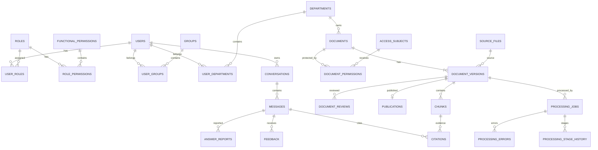

# THIẾT KẾ DATABASE CHO ENTERPRISE RAG PLATFORM

## 1. Định hướng tổng thể

Với toàn bộ Use Case và sơ đồ lớp đã xây dựng, database không nên được thiết kế theo kiểu **mỗi class = một table** một cách máy móc. Nên tách rõ:

- **PostgreSQL**: source of truth cho dữ liệu nghiệp vụ, trạng thái, quyền, audit.
- **Object Storage (MinIO/S3)**: lưu file nguồn PDF/DOCX/XLSX...
- **Vector Store (Qdrant hoặc pgvector)**: lưu embedding/vector phục vụ retrieval.

Kiến trúc tổng quát:

```text
                    ENTERPRISE RAG
                         │
        ┌────────────────┼─────────────────┐
        │                │                 │
        ↓                ↓                 ↓
   PostgreSQL       Object Storage      Vector Store
   nghiệp vụ         PDF/DOCX/...       Chunk vectors
        │
        ├── Identity
        ├── Organization
        ├── RBAC
        ├── Document
        ├── Version
        ├── ACL
        ├── Processing
        ├── Review
        ├── Conversation
        └── Audit
```

Nếu hệ thống đã dùng Qdrant ổn định:

```text
PostgreSQL
→ metadata + business state + permissions + audit

MinIO/S3
→ source files

Qdrant
→ embeddings/vector index
```

Không nên dùng Qdrant làm source of truth cho:

```text
Document status
Version status
ACL
User
Role
Audit
```

---

# 2. Chia PostgreSQL theo domain

Nên dùng một PostgreSQL database nhưng chia logical schema:

```text
enterprise_rag
│
├── iam
│   ├── users
│   ├── roles
│   ├── functional_permissions
│   ├── user_roles
│   ├── role_permissions
│   ├── groups
│   ├── user_groups
│   ├── departments
│   └── user_departments
│
├── kb
│   ├── source_files
│   ├── documents
│   ├── document_versions
│   ├── document_version_status_history
│   ├── document_reviews
│   ├── publications
│   └── document_relations        [future]
│
├── acl
│   ├── access_subjects
│   └── document_permissions
│
├── processing
│   ├── jobs
│   ├── stage_history
│   └── errors
│
├── rag
│   ├── chunks
│   ├── conversations
│   ├── messages
│   ├── citations
│   ├── feedback
│   ├── answer_reports
│   └── chunk_relations           [future]
│
└── audit
    └── audit_logs
```

---

# 3. Nhóm Identity & Organization

## 3.1. `iam.users`

```text
users
─────────────────────────────
id                 UUID PK
company_user_id    VARCHAR UNIQUE
email              VARCHAR UNIQUE
full_name          VARCHAR
status             ENUM
created_at         TIMESTAMP
updated_at         TIMESTAMP
last_login_at      TIMESTAMP
```

Không lưu mật khẩu công ty nếu xác thực được quản lý bởi hệ thống danh tính doanh nghiệp.

### Trạng thái

```text
ACTIVE
LOCKED
DISABLED
```

`ACTIVE` chỉ có nghĩa User được sử dụng hệ thống, không đồng nghĩa có quyền đọc mọi tài liệu.

---

## 3.2. `iam.roles`

```text
roles
────────────────────
id
code
name
description
status
created_at
updated_at
```

Ví dụ:

```text
ADMIN
EMPLOYEE
DOCUMENT_REVIEWER
```

---

## 3.3. `iam.functional_permissions`

Đây là quyền chức năng:

```text
functional_permissions
────────────────────────
id
code
name
description
```

Ví dụ:

```text
ASK_KNOWLEDGE
MANAGE_DOCUMENT
UPLOAD_DOCUMENT
REVIEW_DOCUMENT
PUBLISH_DOCUMENT
MANAGE_USER
MANAGE_ROLE
MANAGE_GROUP
MANAGE_DEPARTMENT
MANAGE_ACCESS_POLICY
```

---

## 3.4. `iam.user_roles`

Quan hệ N-N giữa User và Role:

```text
user_roles
────────────────────
user_id       FK
role_id       FK
assigned_by   FK
assigned_at
```

Constraint:

```sql
UNIQUE(user_id, role_id)
```

---

## 3.5. `iam.role_permissions`

```text
role_permissions
────────────────────
role_id
permission_id
assigned_by
assigned_at
```

Constraint:

```sql
UNIQUE(role_id, permission_id)
```

---

## 3.6. `iam.groups`

```text
groups
────────────────────
id
code
name
description
status
created_at
updated_at
```

Ví dụ:

```text
PROJECT_ALPHA
HR_MANAGER
POLICY_REVIEWER
```

---

## 3.7. `iam.user_groups`

```text
user_groups
────────────────────
user_id
group_id
added_by
joined_at
```

Constraint:

```sql
UNIQUE(user_id, group_id)
```

Một User có thể thuộc nhiều Group.

---

## 3.8. `iam.departments`

```text
departments
────────────────────
id
code
name
description
parent_department_id
status
created_at
updated_at
```

`parent_department_id` hỗ trợ cấu trúc phân cấp:

```text
Khối Công nghệ
├── AI
└── Data
```

---

## 3.9. `iam.user_departments`

Không nên chỉ lưu `users.department_id` nếu muốn giữ lịch sử.

```text
user_departments
────────────────────────
id
user_id
department_id
is_primary
start_at
end_at
assigned_by
```

Ví dụ:

```text
U001 | HR      | 2025-01-01 | 2026-06-30
U001 | FINANCE | 2026-07-01 | NULL
```

---

# 4. Nhóm Document Management

## 4.1. Nguyên tắc cốt lõi

Phải tách:

```text
Document
    1
    │
    └──────── N
           DocumentVersion
```

Không gộp Document và Version vào cùng một table.

---

## 4.2. `kb.documents`

```text
documents
────────────────────────────
id
title
description
document_type
category
document_number
issued_date
effective_date
expiration_date
source
owner_department_id
status
current_version_id
metadata JSONB
created_by
created_at
updated_at
archived_by
archived_at
archive_reason
```

### `status`

Chỉ nên gồm:

```text
DRAFT
PUBLISHED
ARCHIVED
```

Không nên cho các trạng thái sau vào Document:

```text
PROCESSING
FAILED
READY
```

vì đó là trạng thái của ProcessingJob hoặc DocumentVersion.

---

# 5. Metadata

Không nên dùng EAV `key/value` cho toàn bộ metadata khi triển khai PostgreSQL thật.

Nên theo nguyên tắc:

```text
Metadata quan trọng + filter thường xuyên
→ column thực
```

```text
Metadata linh hoạt
→ JSONB
```

Ví dụ:

```json
{
  "language": "vi",
  "topic": "HR",
  "confidentiality": "internal",
  "tags": ["nghỉ phép", "nhân sự"]
}
```

Các trường như:

```text
title
document_type
effective_date
department_id
```

nên là column riêng.

---

# 6. Source File

Nên tách file nguồn khỏi `document_versions`.

## `kb.source_files`

```text
source_files
────────────────────────────
id
original_file_name
mime_type
size_bytes
sha256
storage_bucket
storage_key
created_at
```

Có thể tạo:

```sql
UNIQUE(sha256)
```

nếu chiến lược là lưu một physical blob cho một nội dung byte-identical.

Quan hệ:

```text
DocumentVersion
      ↓
source_file_id
      ↓
SourceFile
```

Lợi ích:

```text
Cùng file upload lại
      ↓
SHA256 match
      ↓
Không upload binary lại
```

---

# 7. `kb.document_versions`

```text
document_versions
──────────────────────────────
id
document_id
version_number
source_file_id
status
previous_version_id
change_summary
effective_date
created_by
created_at
updated_at
```

### Constraint bắt buộc

```sql
UNIQUE(document_id, version_number)
```

Không được tồn tại:

```text
DOC-001
├── v3
└── v3
```

---

# 8. Chỉ được có một ACTIVE Version

Đây là invariant P0.

PostgreSQL nên có partial unique index:

```sql
CREATE UNIQUE INDEX uq_one_active_version_per_document
ON kb.document_versions(document_id)
WHERE status = 'ACTIVE';
```

DB tự chặn:

```text
DOC-001
├── v3 ACTIVE
└── v4 ACTIVE   ❌
```

Không nên chỉ dựa vào code application vì concurrent request có thể phá rule.

---

# 9. `current_version_id`

`kb.documents.current_version_id` giúp truy vấn nhanh phiên bản hiện hành:

```text
DOC-001
current_version_id = V004
```

Khi Publish phải đảm bảo:

```text
V004.document_id = DOC-001
V004.status = ACTIVE
```

và update trong cùng transaction.

---

# 10. Publish phải atomic

Ví dụ:

```text
v3 ACTIVE
v4 READY_FOR_REVIEW
```

Khi publish v4:

```sql
BEGIN;

-- verify v4 publishable

UPDATE kb.document_versions
SET status = 'SUPERSEDED'
WHERE document_id = :doc
AND status = 'ACTIVE';

UPDATE kb.document_versions
SET status = 'ACTIVE'
WHERE id = :v4;

UPDATE kb.documents
SET status = 'PUBLISHED',
    current_version_id = :v4
WHERE id = :doc;

INSERT INTO kb.publications (...);

COMMIT;
```

Nếu bất kỳ bước nào lỗi:

```text
ROLLBACK
```

và v3 vẫn phải ACTIVE.

Không được commit từng bước riêng.

---

# 11. Version History

## `kb.document_version_status_history`

```text
document_version_status_history
──────────────────────────────────
id
document_version_id
old_status
new_status
changed_by
changed_at
reason
```

Ví dụ:

```text
v4
DRAFT            → READY_FOR_REVIEW
READY_FOR_REVIEW → ACTIVE
```

---

# 12. Review

## `kb.document_reviews`

```text
document_reviews
──────────────────────────
id
document_version_id
reviewed_by
decision
review_note
rejection_reason
reviewed_at
```

Decision:

```text
APPROVE
REJECT
REPROCESS
```

Không nên nhét toàn bộ thông tin review trực tiếp vào `document_versions`, vì sau này có thể cần nhiều reviewer.

---

# 13. Publication

## `kb.publications`

```text
publications
────────────────────────────
id
document_id
document_version_id
previous_active_version_id
published_by
published_at
```

Đây là lịch sử/sự kiện publish, không phải nguồn lưu trạng thái hiện tại.

---

# 14. ACL – Document Permission

## 14.1. Vấn đề với `principal_type + principal_id`

Thiết kế:

```text
principal_type = USER/GROUP/ROLE/DEPARTMENT
principal_id = ...
```

dễ hiểu nhưng PostgreSQL không thể tạo foreign key polymorphic tới bốn table khác nhau một cách trực tiếp.

---

## 14.2. Đề xuất `acl.access_subjects`

```text
access_subjects
────────────────────────
id
subject_type
```

`subject_type`:

```text
USER
ROLE
GROUP
DEPARTMENT
```

Mỗi User/Role/Group/Department có một `subject_id`.

Ví dụ:

```text
User A               → S001
Group HR             → S002
Department Finance   → S003
```

---

## 14.3. `acl.document_permissions`

```text
document_permissions
──────────────────────────────
id
document_id
subject_id
permission
status
granted_by
granted_at
revoked_by
revoked_at
```

Ví dụ:

```text
DOC-001
S002 = Group HR
READ
ACTIVE
```

Constraint:

```sql
UNIQUE(document_id, subject_id, permission)
```

hoặc dùng partial unique cho assignment ACTIVE tùy chiến lược lưu lịch sử revoke.

---

# 15. MVP đơn giản hơn

Nếu chưa muốn dùng `access_subjects`, MVP có thể dùng:

```text
document_permissions
───────────────────
document_id
principal_type
principal_id
permission
```

và validate `principal_id` ở service layer.

Cách này dễ triển khai hơn nhưng referential integrity kém hơn.

Nếu thiết kế bài bản lâu dài, nên dùng `access_subjects`.

---

# 16. ALLOW / DENY

Với MVP nên dùng:

```text
ALLOW only
+
default DENY
```

Tức là:

```text
Có assignment
→ ALLOW

Không có assignment
→ DENY
```

Không nên thêm explicit `DENY` quá sớm, vì sẽ phải giải quyết precedence:

```text
User direct ALLOW
Group DENY
Department ALLOW
Role DENY
→ kết quả?
```

MVP nên ưu tiên:

```text
Explicit grant
+
fail closed
```

---

# 17. Processing

Không nên đưa toàn bộ trạng thái processing vào `documents`.

Sai:

```text
documents
────────────────
status
processing_status
ocr_status
embedding_status
index_status
error
retry_count
...
```

Đúng:

```text
DocumentVersion
     1
     │
     └──── N
       ProcessingJob
```

---

# 18. `processing.jobs`

```text
jobs
──────────────────────────────
id
document_version_id
job_type
status
current_stage
attempt_no
previous_job_id
requested_by
requested_at
started_at
completed_at
heartbeat_at
worker_id
```

### Status

```text
PENDING
RUNNING
SUCCEEDED
FAILED
CANCELLED
```

### Job Type

```text
INITIAL_PROCESS
NEW_VERSION
REPROCESS
```

---

# 19. Reprocess

Ví dụ:

```text
v3
│
├── job_001 FAILED
├── job_002 FAILED
└── job_003 SUCCEEDED
```

Đây là model đúng nếu source file không đổi.

Không nên tạo version mới chỉ vì pipeline retry.

---

# 20. `processing.stage_history`

```text
stage_history
────────────────────────
id
processing_job_id
stage
status
started_at
completed_at
message
```

Stage:

```text
FILE_VALIDATION
EXTRACTION
OCR
PARSING
CHUNKING
EMBEDDING
INDEXING
FINALIZING
```

---

# 21. `processing.errors`

```text
errors
────────────────────────
id
processing_job_id
stage
error_type
error_code
safe_message
internal_reference
retryable
created_at
```

Tách `safe_message` khỏi `internal_reference` để UI không lộ secret.

---

# 22. Chunk

Chunk phải gắn với `DocumentVersion`, không chỉ với `Document`.

## `rag.chunks`

```text
chunks
──────────────────────────
id
document_version_id
chunk_index
text
content_hash
page_start
page_end
section_path
metadata JSONB
created_at
```

Constraint:

```sql
UNIQUE(document_version_id, chunk_index)
```

Lý do:

```text
DOC-001 / v3
```

và:

```text
DOC-001 / v4
```

có chunk khác nhau.

---

# 23. Mapping PostgreSQL với Qdrant

PostgreSQL:

```text
chunk_id = C001
document_version_id = V004
```

Qdrant payload:

```json
{
  "chunk_id": "C001",
  "document_id": "DOC-001",
  "document_version_id": "V004"
}
```

Vector point nên tham chiếu về `chunk_id`.

PostgreSQL vẫn là source of truth cho:

```text
Document status
Version status
ACL
```

---

# 24. ACL khi Retrieval

Hướng khuyến nghị:

```text
User
 ↓
PostgreSQL ACL
 ↓
authorized_document_ids
 ↓
Qdrant filter
 ↓
Vector search
```

Tài liệu không có quyền không được trở thành candidate retrieval.

---

# 25. Conversation

Để đáp ứng các Use Case Employee, nên có thêm:

```text
rag.conversations
rag.messages
rag.citations
rag.feedback
rag.answer_reports
```

---

## 25.1. `rag.conversations`

```text
id
user_id
title
created_at
updated_at
```

---

## 25.2. `rag.messages`

```text
id
conversation_id
role
content
created_at
```

Role:

```text
USER
ASSISTANT
SYSTEM
```

---

# 26. Citation

Không nên chỉ lưu text citation.

## `rag.citations`

```text
id
answer_message_id
document_id
document_version_id
chunk_id
page_number
quote_text
citation_order
created_at
```

Nhờ vậy citation luôn truy ngược được về:

```text
Document
Version
Chunk
Page
```

Đây là thành phần quan trọng nếu hệ thống yêu cầu citation chính xác.

---

# 27. Feedback

## `rag.feedback`

```text
id
answer_message_id
user_id
rating
reason
comment
created_at
```

Có thể chọn một trong hai cách:

```text
UP / DOWN
```

hoặc:

```text
1–5
```

Không nên dùng cả hai nếu không có nhu cầu rõ ràng.

---

# 28. Báo cáo câu trả lời

## `rag.answer_reports`

```text
id
answer_message_id
reported_by
report_type
description
status
created_at
resolved_by
resolved_at
```

`report_type`:

```text
INCORRECT
MISSING_CITATION
UNAUTHORIZED_CONTENT
OUTDATED_INFORMATION
OTHER
```

---

# 29. Audit

## `audit.audit_logs`

```text
audit_logs
──────────────────────────
id
actor_user_id
action
entity_type
entity_id
before_data JSONB
after_data JSONB
request_id
ip_address
created_at
note
```

Nên dùng JSONB cho before/after.

Ví dụ:

```json
{
  "status": "PUBLISHED"
}
```

→

```json
{
  "status": "ARCHIVED"
}
```

Không cần tạo hàng loạt FK riêng như:

```text
document_id
role_id
group_id
department_id
...
```

Audit nên là generic append-only event log.

---

# 30. Duplicate / Conflict – Future

Có thể chuẩn bị:

## `kb.document_relations`

```text
id
source_document_id
target_document_id
relation_type
confidence
status
detected_by
reviewed_by
created_at
```

Relation:

```text
DUPLICATE_OF
VERSION_OF
SUPERSEDES
CONFLICTS_WITH
RELATED_TO
```

Nếu cần ở chunk level có thể thêm:

```text
rag.chunk_relations
```

Không nhất thiết phải là P0.

---

# 31. ERD cốt lõi



---

# 32. Constraint bắt buộc

Ít nhất nên có:

```text
users.email
UNIQUE
```

```text
user_roles(user_id, role_id)
UNIQUE
```

```text
user_groups(user_id, group_id)
UNIQUE
```

```text
document_versions(document_id, version_number)
UNIQUE
```

```text
Một ACTIVE version / Document
UNIQUE PARTIAL INDEX
```

```text
source_files.sha256
INDEX / UNIQUE tùy duplicate policy
```

```text
document_permissions(document_id, subject_id, permission)
không có ACTIVE duplicate
```

```text
chunks(document_version_id, chunk_index)
UNIQUE
```

Các bảng con phải có foreign key đúng parent.

---

# 33. Index nên có

```text
users(email)
users(company_user_id)

documents(status)
documents(owner_department_id)
documents(document_type)
documents(effective_date)

document_versions(document_id)
document_versions(document_id, status)

processing_jobs(document_version_id, requested_at DESC)
processing_jobs(status)
processing_jobs(status, current_stage)

document_permissions(subject_id, document_id)
document_permissions(document_id)

chunks(document_version_id)
chunks(content_hash)

messages(conversation_id, created_at)

citations(answer_message_id)

audit_logs(entity_type, entity_id, created_at)
audit_logs(actor_user_id, created_at)
```

Không tạo index cho mọi cột.

Các field như:

```text
description
review_note
archive_reason
error_message
```

thường không cần B-tree index nếu không có access pattern cụ thể.

---

# 34. Transaction Boundaries

Các nghiệp vụ bắt buộc transaction:

## 34.1. Tạo Document lần đầu

```text
Document
+
Version v1
+
ProcessingJob
```

## 34.2. Tạo Version mới

```text
DocumentVersion
+
ProcessingJob
```

## 34.3. Publish

```text
old ACTIVE → SUPERSEDED
new version → ACTIVE
Document.current_version_id → new
Publication
Audit
```

## 34.4. Archive

```text
Document → ARCHIVED
Audit
```

## 34.5. Cấp/thu hồi quyền

```text
PermissionAssignment
+
Audit
```

---

# 35. Không giữ DB transaction trong OCR/Embedding

Không nên:

```text
BEGIN TRANSACTION

INSERT Document

OCR 30 giây
Embedding 10 giây
Indexing 5 giây

COMMIT
```

Nên:

```text
Transaction 1
─────────────
Create Document
Create Version
Create ProcessingJob = PENDING
COMMIT

        ↓

Worker chạy async

        ↓

Transaction 2
─────────────
Update Job status
Update Version
COMMIT
```

Không giữ transaction dài trong quá trình xử lý AI.

---

# 36. Ví dụ trạng thái trong DB

```text
DOC-001
status = PUBLISHED
current_version_id = V3
```

Versions:

| Version | Status |
|---|---|
| v1 | SUPERSEDED |
| v2 | SUPERSEDED |
| v3 | ACTIVE |
| v4 | DRAFT |

Processing:

| Version | Job | Status |
|---|---|---|
| v3 | J11 | SUCCEEDED |
| v4 | J12 | FAILED |

Employee vẫn sử dụng:

```text
DOC-001 / v3
```

vì:

```text
Document = PUBLISHED
v3 = ACTIVE
```

v4 lỗi không làm toàn bộ Document bị lỗi.

---

# 37. Ưu tiên triển khai

## P0 – Nên có ngay

```text
users
roles
functional_permissions
user_roles
role_permissions

groups
user_groups

departments
user_departments

source_files
documents
document_versions

access_subjects
document_permissions

processing_jobs
processing_errors

document_reviews
publications

chunks

conversations
messages
citations
feedback
answer_reports

audit_logs
```

## P1

```text
processing_stage_history
document_version_status_history
document_relations
```

## P2

```text
chunk_relations
materialized permission matrix
advanced policy hierarchy
explicit DENY
```

---

# 38. PostgreSQL + Qdrant hay PostgreSQL + pgvector?

Nếu Qdrant đang chạy ổn:

```text
PostgreSQL
+
Qdrant
+
MinIO/S3
```

là hợp lý.

Nếu bắt đầu MVP từ đầu và dữ liệu chưa lớn:

```text
PostgreSQL
+
pgvector
+
MinIO/S3
```

có thể đơn giản vận hành hơn.

Trong cả hai trường hợp:

```text
PostgreSQL
=
Source of Truth
```

Vector DB chỉ phục vụ retrieval.

---

# 39. Kiến trúc dữ liệu cuối cùng

```text
                 PostgreSQL
                     │
        ┌────────────┼────────────┐
        ↓            ↓            ↓
    Identity      Knowledge     Governance
        │            │            │
User / Role       Document       Review
Group / Dept        │            Publish
                     ↓            Audit
                  Version
                     │
                     ↓
               ProcessingJob
                     │
                     ↓
                   Chunk
                     │
                     ↓
                  Qdrant
```

---

# 40. Bốn invariant quan trọng nhất

## Invariant 1

Một `Document` chỉ có tối đa một `ACTIVE DocumentVersion`.

```text
Document
    ↓
max 1 ACTIVE Version
```

## Invariant 2

Employee chỉ được retrieval khi:

```text
Document = PUBLISHED
AND
Version = ACTIVE
AND
User có READ
```

## Invariant 3

Reprocess:

```text
REPROCESS
=
ProcessingJob mới
```

không phải:

```text
DocumentVersion mới
```

nếu source file không đổi.

## Invariant 4

Publish phải atomic:

```text
old ACTIVE → SUPERSEDED
new candidate → ACTIVE
current_version_id → new
Publication + Audit
```

Nếu transaction thất bại:

```text
ROLLBACK
```

và phiên bản ACTIVE cũ phải tiếp tục phục vụ.

---

# 41. Kết luận

Database nên được thiết kế xoay quanh hai trục chính:

```text
User
├── Role
├── Group
└── Department
      ↓
Document Permission
      ↓
Document
```

và:

```text
Document
    ↓
DocumentVersion
    ↓
ProcessingJob
    ↓
Chunk
```

Thiết kế này giúp:

- tách rõ RBAC và ACL;
- quản lý version đúng nghiệp vụ;
- hỗ trợ Reprocess mà không phá version history;
- giữ trạng thái Document, Version và Processing độc lập;
- hỗ trợ Review, Publish, Archive;
- bảo đảm citation truy ngược đúng version/chunk;
- triển khai authorization trước retrieval;
- mở rộng duplicate/conflict sau này;
- giữ PostgreSQL làm source of truth trong toàn bộ hệ thống.

---

# PHỤ LỤC: ĐIỀU CHỈNH CHO STACK SUPABASE + PGVECTOR HIỆN TẠI

Với cấu hình hiện tại, kiến trúc dữ liệu nên được cụ thể hóa như sau:

```text
Supabase
├── Auth                  → xác thực người dùng
├── PostgreSQL            → source of truth nghiệp vụ
├── Storage               → lưu file nguồn
└── pgvector              → lưu embedding/vector

FastAPI
├── Authentication / Authorization
├── Document Management
├── Processing Worker
├── Retrieval
└── Generation
```

## 1. User

Không tạo bảng User chứa password riêng. Dùng `auth.users` của Supabase cho identity/authentication và tạo `public.user_profiles` cho dữ liệu nghiệp vụ:

```sql
CREATE TABLE public.user_profiles (
    user_id UUID PRIMARY KEY REFERENCES auth.users(id) ON DELETE RESTRICT,
    company_user_id TEXT UNIQUE,
    full_name TEXT,
    status TEXT NOT NULL DEFAULT 'ACTIVE'
        CHECK (status IN ('ACTIVE', 'LOCKED', 'DISABLED')),
    created_at TIMESTAMPTZ NOT NULL DEFAULT now(),
    updated_at TIMESTAMPTZ NOT NULL DEFAULT now()
);
```

## 2. File nguồn

Dùng Supabase Storage thay vì MinIO cho MVP. Có thể tạo bucket `knowledge-source-files` và bảng nghiệp vụ:

```text
source_files
├── id
├── bucket_name
├── object_path
├── original_file_name
├── mime_type
├── size_bytes
├── sha256
├── created_by
└── created_at
```

Không nhất thiết đặt `UNIQUE(sha256)` ngay nếu duplicate/version policy cần linh hoạt; nên tạo index để lookup nhanh.

## 3. Document và DocumentVersion

Giữ nguyên nguyên tắc:

```text
Document 1 ─── N DocumentVersion
```

`documents.status` chỉ gồm:

```text
DRAFT
PUBLISHED
ARCHIVED
```

`document_versions.status` gồm:

```text
DRAFT
READY_FOR_REVIEW
ACTIVE
REJECTED
SUPERSEDED
```

Bắt buộc có:

```sql
UNIQUE(document_id, version_number)
```

và partial unique index:

```sql
CREATE UNIQUE INDEX uq_document_one_active_version
ON public.document_versions(document_id)
WHERE status = 'ACTIVE';
```

## 4. Processing Job

Cấu hình worker hiện tại dùng polling + lease, vì vậy `processing_jobs` nên là durable queue:

```text
processing_jobs
├── id
├── document_version_id
├── job_type
├── status
├── current_stage
├── attempt_no
├── previous_job_id
├── requested_by
├── requested_at
├── started_at
├── completed_at
├── heartbeat_at
├── lease_owner
└── lease_expires_at
```

Các status:

```text
PENDING
RUNNING
SUCCEEDED
FAILED
CANCELLED
```

Các stage phù hợp pipeline hiện tại:

```text
FILE_VALIDATION
EXTRACTION
OCR
PARSING
CHUNKING
CONTEXTUAL_ENRICHMENT
EMBEDDING
INDEXING
FINALIZING
```

Worker nên claim job bằng transaction và `FOR UPDATE SKIP LOCKED` để tránh nhiều worker lấy cùng một job.

## 5. Reprocess

```text
File không đổi + pipeline lỗi
→ tạo ProcessingJob mới

File/nội dung thay đổi
→ tạo DocumentVersion mới
```

Không tạo version mới chỉ vì retry.

## 6. pgvector

Vì `VECTOR_STORE_BACKEND=pgvector`, embedding nên nằm ngay trong PostgreSQL:

```sql
CREATE EXTENSION IF NOT EXISTS vector;
```

Ví dụ bảng chunk:

```text
chunks
├── id
├── document_version_id
├── chunk_index
├── content
├── contextual_content
├── content_hash
├── page_start
├── page_end
├── section_path
├── metadata JSONB
├── search_vector TSVECTOR
└── embedding VECTOR(1536)
```

Nếu dùng dimension khác với mặc định của model embedding, phải đổi `VECTOR(1536)` cho đúng.

Index vector:

```sql
CREATE INDEX chunks_embedding_hnsw_idx
ON public.chunks
USING hnsw (embedding vector_cosine_ops);
```

## 7. Hybrid Retrieval

Vì hệ thống hiện tại có Dense + Sparse + RRF, PostgreSQL có thể hỗ trợ sparse search bằng `tsvector`/GIN hoặc giữ BM25 ở application layer.

Luồng bắt buộc:

```text
User
 ↓
Resolve quyền
 ↓
Authorized Documents
 ↓
PUBLISHED Documents
 ↓
ACTIVE Versions
 ↓
Dense + Sparse Retrieval
 ↓
RRF
 ↓
MMR / Rerank
 ↓
Evidence
 ↓
LLM
```

Invariant:

```text
CAN_RETRIEVE
=
PUBLISHED
AND ACTIVE
AND READ
```

Unauthorized document không được trở thành retrieval candidate, không tới reranker và không tới LLM.

## 8. Supabase RLS

Có thể bật Row Level Security cho các bảng nhạy cảm như:

```text
documents
document_versions
chunks
conversations
messages
citations
```

Tuy nhiên nếu FastAPI dùng server-side secret credential, RLS chỉ là defense-in-depth. Authorization vẫn phải được thực thi trong backend.

## 9. Các bảng nên có trong Supabase MVP

```text
public
├── user_profiles
├── roles
├── functional_permissions
├── user_roles
├── role_permissions
├── groups
├── user_groups
├── departments
├── user_departments
├── source_files
├── documents
├── document_versions
├── document_permissions
├── processing_jobs
├── processing_errors
├── chunks
├── document_reviews
├── publications
├── conversations
├── messages
├── citations
├── feedback
├── answer_reports
└── audit_logs
```

P1:

```text
processing_stage_history
document_version_status_history
document_relations
```

## 10. Kiến trúc cuối cùng

```text
SUPABASE
│
├── Auth
│   └── auth.users
│
├── PostgreSQL
│   ├── Identity / RBAC
│   ├── Document / Version
│   ├── ACL
│   ├── Processing
│   ├── Chunk + pgvector
│   ├── Conversation / Citation
│   └── Audit
│
└── Storage
    └── knowledge-source-files
```

Với stack này, không cần thêm Qdrant hoặc MinIO cho MVP nếu Supabase + pgvector đáp ứng tải thực tế.

## 11. Bảo mật biến môi trường

Các secret phải chỉ nằm ở backend và không commit vào Git:

```text
SUPABASE_SECRET_KEY
OPENAI_API_KEY
LANGFUSE_SECRET_KEY
```

Frontend chỉ sử dụng publishable/public values phù hợp. Nếu secret đã từng bị chia sẻ ngoài môi trường kiểm soát, cần rotate/revoke và cấp lại key mới.
