# Bản đồ sử dụng metadata hiện tại

## Cách đọc

`metadata_schema.csv` là inventory máy đọc được. Tài liệu này chỉ ra field **thực sự được code sử dụng** và phân biệt ba trạng thái:

- **Direct**: field được production path đọc trực tiếp.
- **Indirect**: field tham gia qua object/context builder hoặc qua document scope trước retrieval.
- **Persisted only**: field được lưu/audit nhưng production retrieval hiện không đọc trực tiếp.

Không có nhãn “filter” nào được gán chỉ vì field có vẻ phù hợp để filter.

Cột `mutable_over_time` phân biệt state lifecycle có thể update (`true`), field ổn định (`false`) và metadata được tính lại khi re-ingestion/re-index (`recomputed_on_reingestion`). Cách phân loại này mô tả write path hiện tại; nó không cấp quyền cho audit tool sửa dữ liệu.

## Luồng field hiện tại

```mermaid
flowchart LR
    A["Upload + documents row<br/>owner/notebook, filename, MIME, storage, content_hash"]
    B["Parser / OCR / sanitizer<br/>pages, blocks, tables, parser diagnostics"]
    C["Document identity<br/>normalized hash, SimHash, quality evidence"]
    D["structure_recursive chunker<br/>chunk index, page, section, source blocks"]
    E["Pre-embedding quality<br/>exact reuse + near/version/conflict candidates"]
    F["Per-chunk context enricher<br/>contextual summary + search terms"]
    G["Context builders<br/>embedding_text + application search_text"]
    H["document_chunks<br/>core columns + JSONB metadata + pgvector"]
    I["Dense HNSW cosine<br/>owner/notebook/document filters"]
    J["PostgreSQL FTS / GIN<br/>weighted tsvector + same filters"]
    K["RRF -> exact-group collapse -> lexical MMR"]
    L["Generation context<br/>content + source/page/section + SRC-N"]

    A --> B --> C --> D --> E --> F --> G --> H
    H --> I --> K
    H --> J --> K --> L
```

Không có bước LLM “query metadata extraction” trong active path. Scope filter đến từ auth/notebook và document selection; query contextualization/reformulation hiện là heuristic.

## Luồng tạo và lưu

| Giai đoạn | Field/nhóm field | Nguồn code | Trạng thái |
|---|---|---|---|
| Upload | `owner_id`, `notebook_id`, filename, storage path, MIME, size, raw `content_hash` | `app/documents`, `supabase/migrations/02_tables.sql` | Authoritative |
| Parse/extract | parser name/version, page, heading, block type, PDF/OCR/workbook diagnostics | `app/pipeline/documents` | Deterministic/parser-derived |
| Document identity | normalized hash, normalization version, loose SimHash, size eligibility | `app/pipeline/documents/application/content_identity.py`, `app/knowledge_quality` | Rule-derived; strict hash authoritative only when eligibility invariants hold |
| Chunk | index, page, section, offsets, source blocks, `source_chunk_id`, strategy/checksums | `app/pipeline/indexing/domain/chunking_strategies.py`, `.../application/chunker.py` | Deterministic |
| Pre-embedding quality | exact group, relation candidate, verifier scores, vector-reuse provenance | `app/knowledge_quality/application/chunk_preembedding.py` | Candidate/decision evidence |
| Context enrichment | contextual summary, search terms, model/prompt/input/error provenance | `app/pipeline/indexing/adapters/context_enrichers.py`, `.../application/pipeline.py:318-383` | LLM semantic context; non-authoritative |
| Persistence | chunk core columns + JSONB metadata + vector | `app/ingestion/application/worker.py:690-706`, migrations 02/09 | Persisted |

## Dense embedding

`app/shared/contextual_text.py:92` tạo `embedding_text`; `app/pipeline/indexing/application/pipeline.py:377` xây lại nó sau contextual enrichment. Nội dung đưa vào embedding đến từ:

| Field | Cách dùng | Direct/indirect |
|---|---|---|
| `title` | Dòng context document | Direct qua `ChunkContext` |
| `document_type` | Dòng context type | Direct |
| `section_path`, fallback `section_title` | Dòng context section | Direct |
| `content_kind` | Dòng context content type | Direct |
| `table_header` | Khôi phục nghĩa cho row/table chunk | Direct |
| `keyword_aliases` | Alias context | Direct |
| `contextual_summary` | Context LLM riêng cho chunk | Direct sau enrichment |
| `content` | Bằng chứng gốc, luôn nối sau context | Direct |
| `contextual_search_terms` | Không nằm trong dense text theo builder hiện tại | Không dùng trong embedding |

`embedding_text_checksum` được lưu để liên kết vector với input; text đầy đủ không phải cột DB riêng. OpenAI adapter không có bước normalize vector rõ ràng.

## Sparse indexing và boost

Production active adapter là `PostgrestFullTextRetrievalAdapter` tại `app/retrieval/adapters/postgrest_full_text_search.py`. RPC `search_document_chunks_keyword` và `ts_rank_cd` được tạo ở migration 11; migration 12 thay generated `search_vector` để bổ sung LLM context. Đây là PostgreSQL full-text ranking, **không phải BM25**.

| FTS weight | Field | Ý nghĩa boost |
|---|---|---|
| A | `title` | mạnh nhất |
| B | `section_title`, `section_path`, `table_header`, `contextual_summary` | cấu trúc/context mạnh |
| C | `document_type`, `content_kind`, `keyword_aliases`, `contextual_search_terms` | alias/type/context hỗ trợ |
| D | `content` | nội dung gốc |

`search_text` do Python builder tạo là một contract hữu ích cho adapter/in-memory path, nhưng generated `search_vector` production đọc trực tiếp JSONB + `content`; nó không đọc `search_text` đã render. `search_text_checksum` vì vậy là provenance application, không phải checksum của PostgreSQL `tsvector`.

## Hard filter và access control

| Field | Dense | Sparse | Lớp bảo vệ |
|---|---|---|---|
| `owner_id` | RPC pgvector bắt buộc | RPC FTS bắt buộc | RLS + adapter contract |
| `notebook_id` | truyền vào vector query/backend | FTS optional param nhưng service truyền scope | RLS/application scope |
| `document_ids` | RPC array filter | RPC array filter | Chat resolves allowed IDs trước retrieval |
| `is_current` | không truyền thẳng | không truyền thẳng | Indirect: chat service chọn current/canonical document IDs |
| `canonical_document_id` | không truyền thẳng | không truyền thẳng | Indirect: resolve requested duplicate sang canonical |
| `document_type`, `status`, `version_number`, `quality_status` | không | không | Không phải production hard filter hiện tại |

`owner_id`/`notebook_id` tuyệt đối không được LLM tạo hoặc sửa. `allowed_groups`, `access_level`, `tenant_id` theo schema đề xuất trước đây **không tồn tại như production fields** trong repo này; không được đưa vào baseline như dữ liệu hiện có. Current tenancy boundary là `owner_id` + `notebook_id`.

## Fusion, duplicate collapse và reranking

| Field | Nơi dùng | Hành vi |
|---|---|---|
| dense/sparse rank | `ReciprocalRankFusion` | RRF theo rank, `k=60`; không cộng raw score |
| `exact_duplicate_group_id` | `agentic_retrieval.py`, `mmr_reranker.py` | collapse exact group khi quality mode `on` |
| `normalized_content_hash` | retrieval hit metadata / fallback identity | exact identity evidence |
| `document_id` | MMR/quota | tối đa 2 chunks/document mặc định |
| chunk text | `mmr_reranker.py` | lexical-shingle similarity để đa dạng hóa |
| `duplicate_source_document_ids` | agentic collapse | giữ provenance của group đã collapse |
| `pre_embedding_quality.*` | indexing/reuse, không phải generic rerank features | audit quyết định trước embedding |

`pre_embedding_quality.target_chunk_id` có hai namespace hợp lệ: persisted `chunk_id` cho match từ database và deterministic `source_chunk_id` cho match trong `current_batch`. `target_chunk_index` và `simhash_hamming_distance` là evidence chẩn đoán, không phải khóa identity độc lập.

Không có learned cross-encoder reranker trong active path. `title`, `document_type`, authority hay dates không được đưa vào một scoring model sau RRF; nếu nói chúng “rerank” thì chỉ đúng gián tiếp qua FTS weights hoặc document scoping.

## Version và conflict

Document relation/version fields được enforcement trong migrations 08/09 và `app/knowledge_quality`. Chat service giữ cả hai phía của confirmed conflict trong scope, gắn `confirmed_conflict_peer_document_ids` lên evidence ở `app/chat/application/services.py:172-194`, sau đó generator buộc citation hai phía.

| Field | Production use | Giới hạn |
|---|---|---|
| `version_group_id`, `version_number`, `is_current` | lifecycle, current selection, quality API | không phải direct retrieval score/filter |
| `effective_from`, `effective_to`, `supersedes_document_id` | version action/audit | thiếu giá trị không được LLM đoán |
| `quality_status` | review/lifecycle | candidate status không đồng nghĩa human gold |
| `authority_metadata` | được mang theo chunk | open JSONB; active generic reranker chưa dùng |
| `pre_embedding_quality.relation_type=conflict_candidate` | pre-index candidate | không phải confirmed conflict |
| confirmed document relation | chat/generator | authoritative workflow result; giữ citation cả hai phía |

Generator còn chạy text-level `detect_conflicts` heuristic trên retrieved evidence. Đây là lớp cảnh báo/generation, không sửa metadata nguồn.

## Citation và display

`document_id`, `chunk_id`, chunk content, title, page, section và source provenance là dữ liệu citation. Generator ánh xạ evidence thành alias tạm `SRC-1`, `SRC-2`, ... tại `app/generation/adapters/openai_generator.py:91`. Alias chỉ có giá trị trong một lượt trả lời; nó không phải persistent chunk ID.

`page_number` dùng policy first-source-token. Vì vậy citation “trang N” là locator khởi đầu, không chứng minh toàn bộ chunk chỉ nằm trên trang N. `original_filename`/title có thể là fallback và phải được human-audit để tránh citation sai tên.

## Field được lưu nhưng chưa khai thác retrieval trực tiếp

- parser/extraction diagnostics (`pdf_type`, OCR flags/counts, confidence)
- `strategy_version`, `config_checksum`, parser version
- `effective_from`/`effective_to` và phần lớn version metadata
- `quality_metadata` và phần lớn `pre_embedding_quality` evidence
- `provenance_metadata`, `authority_metadata`
- checksums và ingestion generation

Các field này vẫn quan trọng cho reproducibility, audit và conflict/version control; baseline không tự coi “không dùng retrieval” là “vô ích”.

## Khoảng trống schema hiện hữu

`document_chunks.metadata`, `quality_metadata`, `provenance_metadata` và `authority_metadata` là JSONB mở. Database chỉ ép kiểu object ở cấp container, không ép tất cả nested key. Parser-specific metadata còn thay đổi theo MIME và extraction route. Inventory liệt kê toàn bộ field core/known được tìm thấy trên active path; audit distribution phải phát hiện key thực tế ngoài schema và các generation không nhất quán trong corpus.

Inventory đã tách riêng evidence fingerprint trong `quality_metadata`: `normalization_version`, `character_count`, `token_count`, `numbers`, `dates`, `has_negation`, `identity_trusted`, `projection_source`, `table_count`, `fallback_used`, `unrepresented_visual_count` và `replacement_character_count`. Đây là dữ liệu rule/parser-derived; không field nào trong nhóm này được phép suy đoán bằng LLM.

## Quan sát từ snapshot 2026-08-03

- 257/257 chunk có core identity, source locator, chunk fingerprint và exact duplicate group.
- 257/257 `retrieval_metadata`, `provenance_metadata` và `authority_metadata` là object rỗng. Vì vậy các weight A/B/C được migration FTS hỗ trợ về mặt code nhưng không nhận tín hiệu từ các field này trong snapshot.
- 0/257 chunk có `context_enrichment`; không được suy diễn rằng feature tắt, chỉ có thể nói dữ liệu snapshot chưa mang output enrichment.
- 4/24 document có fingerprint v2 đầy đủ; 20 document còn lại thuộc generation dữ liệu chưa có các field này.
- 14/257 chunk có `pre_embedding_quality`; các relation là candidate/action evidence, không phải human-confirmed duplicate hoặc conflict.

Các field transient `embedding_text` và `search_text`, cùng operational ingestion-job fields, được ghi trong CSV để tái lập pipeline nhưng không bị tính coverage trên document/chunk export vì level của chúng không phải `document`/`chunk`.
